# 欢迎阅读本教程，NAS+ESP32 项目之：ESP32 内网实时读取 NAS 系统信息

**目录**
[toc]

## 最终效果

最终效果有 2 方面结果，1 是手机、电脑，内外网随时获得设备信息，设备信息如下。

```json
{
  "status": "success",
  "code": 200,
  "ip": ["192.168.31.202", 8080],
  "message": {
    "DiskUsage": 38.0,
    "netsent": "506.8KB/s",
    "netrecv": "32.3KB/s",
    "uptime": [72, 15, 48, 48],
    "CPU": 8.8,
    "RAM": 1.71,
    "RAMPercent": 74.3,
    "TEMP": 34.0
  }
}
```

2.是通过物联网芯片，如 ESP32、8266、Arduino 等获取设备信息并通过各类屏幕展示。

此处待完善

## 后端搭建部署

整个系统分为 2 部分：1 是群晖的 linux 跑一个 python 代码，部署一个 UDP 服务器，外部获取这个 UDP 信息得到数据；2 是外部设备自身的刷新率、展示等。此处后端搭建部署指第一部分，即数据提供的后端部分。

1.从 web 端进入群晖系统，点击路径为：控制面板——>终端机和 SNMP ——> 启动 ssh ，并点击应用。端口一般 22 不动。**记得点击右下角 '应用'**

<div style="vertical-align: middle;text-align: center;">
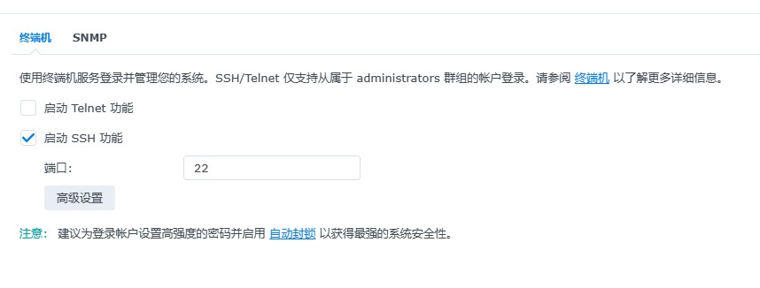
</div>

2.电脑上，打开终端（mac 叫终端，win 叫 cmd 那玩意），然后输入：`ssh 用户名@内网ip` ，例如我的：`ssh ssh@192.168.1.99`,这步 ok 的话会让输入密码，然后输入密码即可。进入后如下图形式。

<div style="vertical-align: middle;text-align: center;">
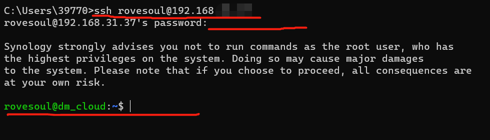
</div>

3. 输入一下 `ls` 看看有哪些文件夹，如果啥都没有，去 web 端建立个放此程序的文件夹，或者去选定一个记住，此处演示创建一个 lalalala 文件夹来放程序。
<div style="vertical-align: middle;text-align: center;">
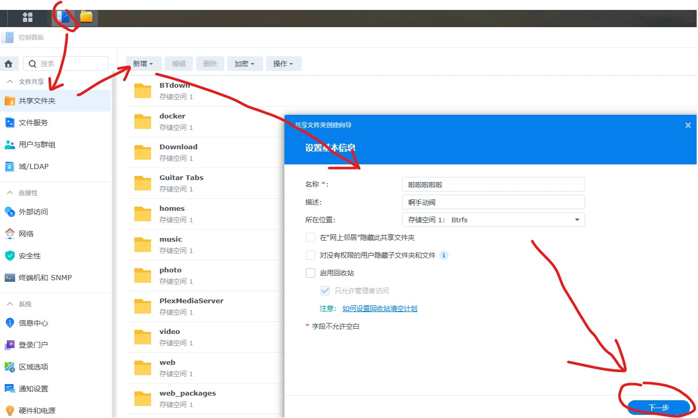
</div>

4. 回到终端中，首先`sudo -i` 切换 root 用户；然后输入

```cmd
rovesoul@dm_cloud:~$ sudo -i
输入密码:
root@dm_cloud:~# ls                       //看看有啥，不重要
root@dm_cloud:~# cd /usr/volume1          //切入系统盘中
root@dm_cloud:/volume1#  pwd              //演示一下路径
/volume1                                  //当前路径
root@dm_cloud:/volume1# ls                //看看有啥J
```

<div style="vertical-align: middle;text-align: center;">
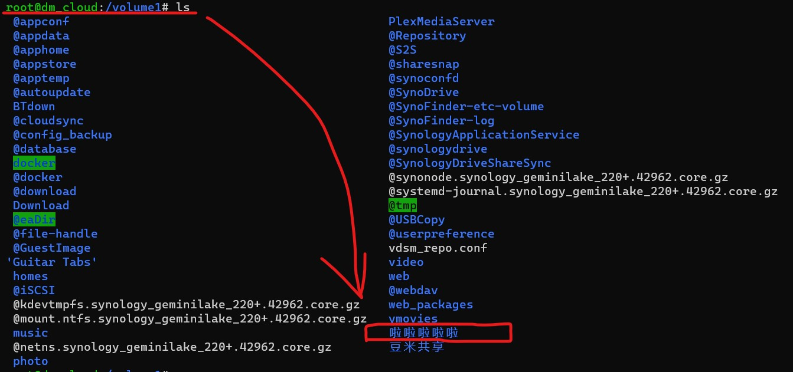
</div>

5. 在 web 页面上，把程序拖入啦啦啦啦文件夹中。准备后续运行，代码是 python3 写的，因此需要看看系统是否有 python3，以及依赖的 psutil 库。 我刚操作的时候 python3 有，但是没有 pip 环境，自行百度装一个 pip，然后装 psutil

```
root@dm_cloud:/volume1# python                                              //看是否有python3
Python 3.8.12 (default, Nov 15 2021, 06:04:41)
[GCC 8.5.0] on linux
Type "help", "copyright", "credits" or "license" for more information.
>>> quit()
root@dm_cloud:/volume1# pip list                                            //看是否有需要的依赖
Package    Version
---------- -------
pip        22.3.1
psutil     5.9.4
```

6. 如果上述步骤均 ok，则一行代码后台运行即可
   `nohup python UDPServerSys.py >> my.log 2>&1 &`

   其他. 如果杀死这个进程 `kill -9 进程号码`
   进程号码查询：`ps -ef | grep python` ,下面演示截图中，23726 为其进程

<div style="vertical-align: middle;text-align: center;">
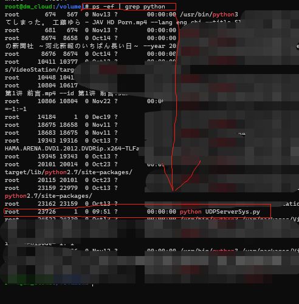
</div>

7. 如何其他设备访问呢？代码中，端口为 18000，ip 的 0.0.0.0 代表 nas 的内外网 ip。所以 举例中的访问号码为`192.168.1.99:18000`
<div style="vertical-align: middle;text-align: center;">
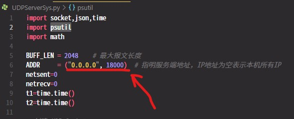
</div>

8. 用电脑下载一个网络测试软件，或者手机上安装一个测试软件，win 中这个软件左上角创建本地 UDP 客户端，右下角红框发送任意内容，此处输入的 1，发送后，得到蓝框中返回内容。
   同样，在 iphone 中找一个测试工具，创建一个 UDP 客户端，输入好地址后，随便发送内容，获得返回数据。

<div style="vertical-align: top;text-align: center;">
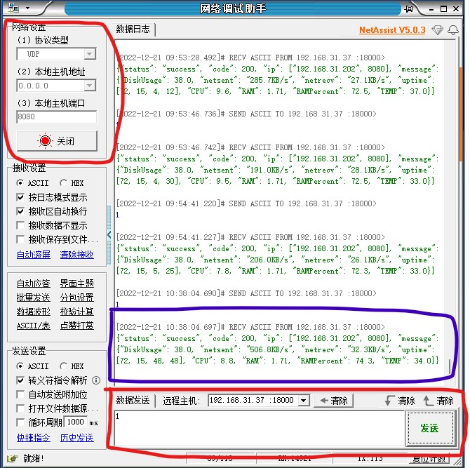
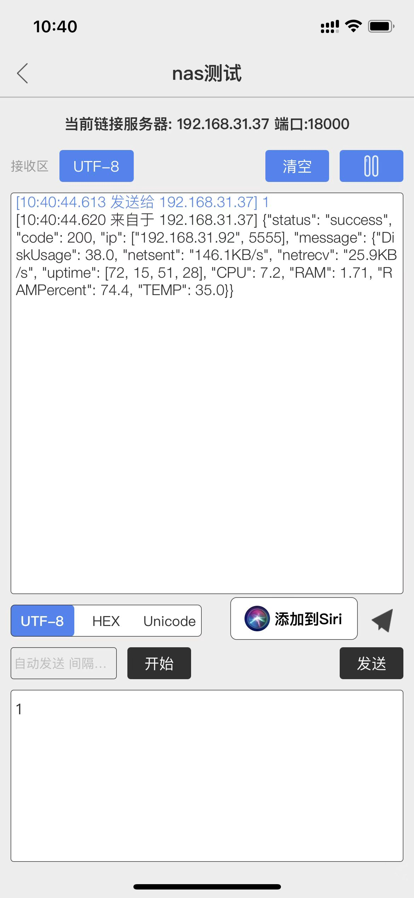
</div>

**至此，通过局域网外部获取 nas 信息完成。至此，没有 ESP32 ESP8266 Arduino 等物联网设备也无妨。因为随时随地在家在外边不登陆 nas 的 web 端，也可实时获取设备主要信息。**

## 返回数据介绍

返回数据内容如下,为了便于理解，增加了备注并换行显示了。

```json
{
  "status": "success", //成功标识，不重要
  "code": 200, //成功号码，不重要
  "ip": ["192.168.31.202", 8080], //获取方设备的ip（win或iphone的内外网ip）
  "message": {
    "DiskUsage": 38.0, //硬盘使用百分比，此时38%
    "netsent": "506.8KB/s", //网络发送
    "netrecv": "32.3KB/s", //网络接受
    "uptime": [72, 15, 48, 48], //开机时间，此时72天15时48分48秒
    "CPU": 8.8, //cpu 使用百分比
    "RAM": 1.71, //内存1.71G，我是按1024除下来的，有缩减，厂商都按1000进制计算的
    "RAMPercent": 74.3, //内存使用百分比。比 web端显示的高。web端那个数据我各种算没算出来他怎么计算的
    "TEMP": 34.0 //cpu 第一个核 的温度
  }
}
```

## 物联网芯片部分，(ESP32 为例）

1. 购买硬件，包括 ESP32-S2 芯片、TFT 屏幕 ，其他按需购买。

<div style="vertical-align: top;text-align: center;">
    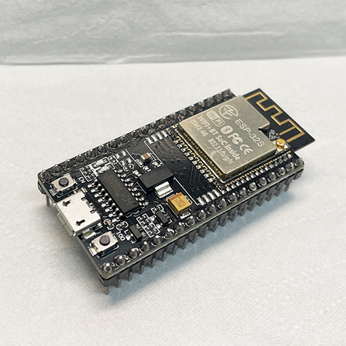
    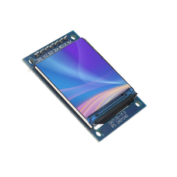
</div>

2. 搭建 ESP 开发环境，我选用的是 MicroPython。自行百度学习 thonny IDE 给 ESP32 刷 micropython 系统
3. 搭建好后，有个测试见程序文件`testSocketESP32.py`文件，不感兴趣可跳过本步骤 3。其中`wlan.connect('2.4网络名', '88888888')`这行代码前边是你家 2.4G 无线网络的账号，后边 88888888 是密码。自行替换。这个测试程序是通过 ESP32 创建 UDP 服务器，获得外部客户端发送指令，控制芯片 2 号引脚对应的蓝色 led 灯开关。
<div style="vertical-align: top;text-align: center;">
    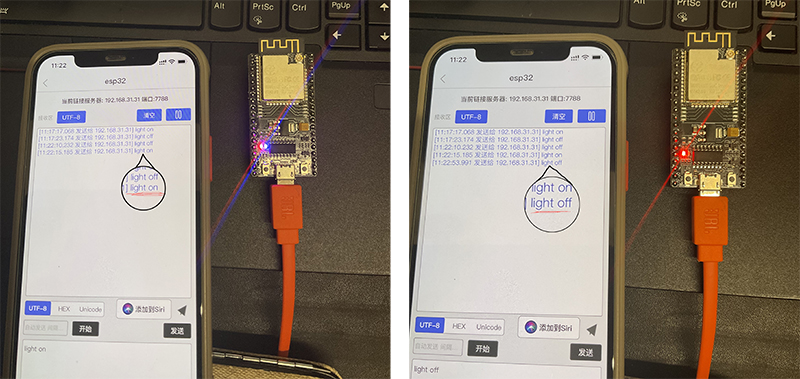
</div>

4. 通过 ESP32 联网后获得服务。[micropython-socket 文档](http://docs.micropython.org/en/latest/library/socket.html)
   在程序中，boot.py 文件是对应 ESP32 的 boot，代码中需要修改内容为：
   nasIP:NAS 对应的内网 ip
   nasSysPort:数据后端开启的 UDP 服务端口

```python
nasIP="192.168.31.37"
nasSysPort=18000
```

…or create a new repository on the command line
echo "# NAS-and-ESP32-Server" >> README.md
git init
git add README.md
git commit -m "first commit"
git branch -M main
git remote add origin https://github.com/rovesoul/NAS-and-ESP32-Server.git
git push -u origin main
…or push an existing repository from the command line
git remote add origin https://github.com/rovesoul/NAS-and-ESP32-Server.git
git branch -M main
git push -u origin main
…or import code from another repository
You can initialize this repository with code from a Subversion, Mercurial, or TFS project.
